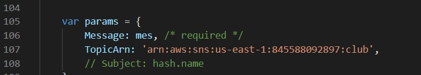
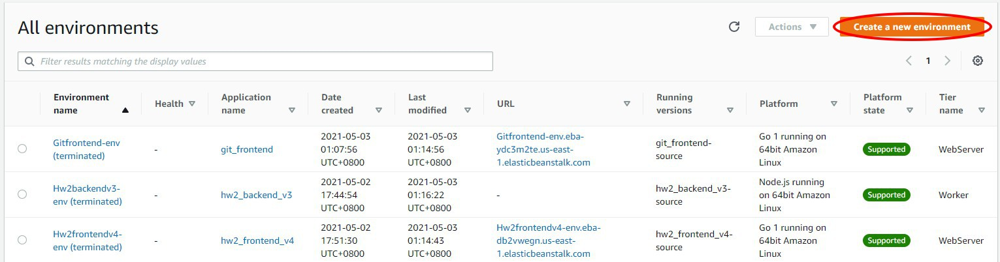
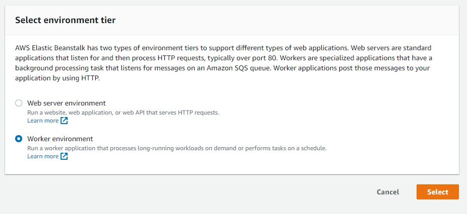
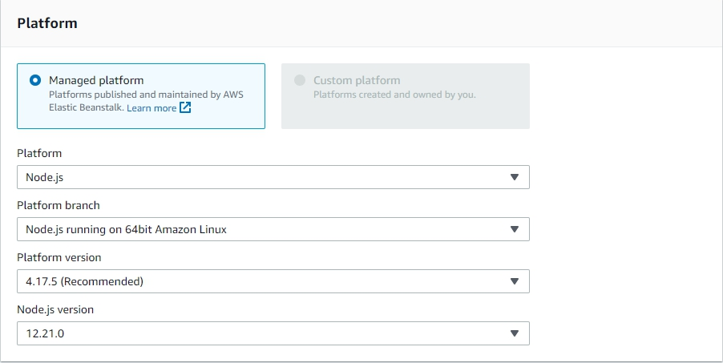

# Backend

A sample application for AWS Elastic Beanstalk worker tier, implemented in node.js.
This application recieves messages from remote server and send email to the topic's subscribers.

## How it works

aws-sqsd polls Amazon SQS. When message found, 
it makes HTTP POST request to node.js via nginx.

### Architecture

SQS <-(polling)- aws-sqsd -> nginx(port:80) -> node.js(port:8081)

## How to use

1. Create a Standard Topic in AWS Simple Notification Service and Subscribed it by your email

2. Download file as zip

3. In server.js:107. Change the topic arn to yours


4. Zip the files back

5. Go to AWS Elastic Beanstalk and create a new worker environment. 
* Platform : Node.js
* Platform branch : Node.js running on 64bit Amazon Linux
* Platform version : 4.17.5
* Node.js version : 12.21.0
<br><br>
<br><br>


6. Upload this file(as .zip)

7. Select Configure more options 
* Edit Instances
* Edit Security

## How it runs
1. There will be two queues added in AWS Simple Queue Service
* WorkerQueue : Try to send some messages. messages should be like the following json form
```
{"name":"John","email":"xxx@example.com","gender":"Male"}
```
* WorkerDeadLetterQueue : for holding the message that could not be
successfully processed. It can be used to analyze problem

2. You recieve an e-mail with a welcome message