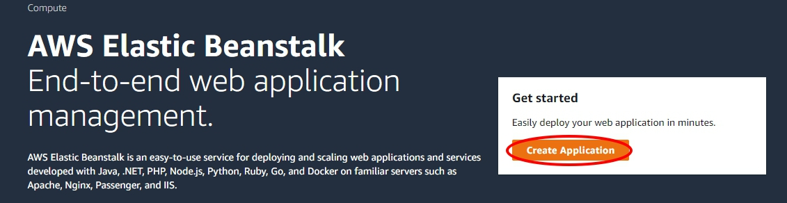
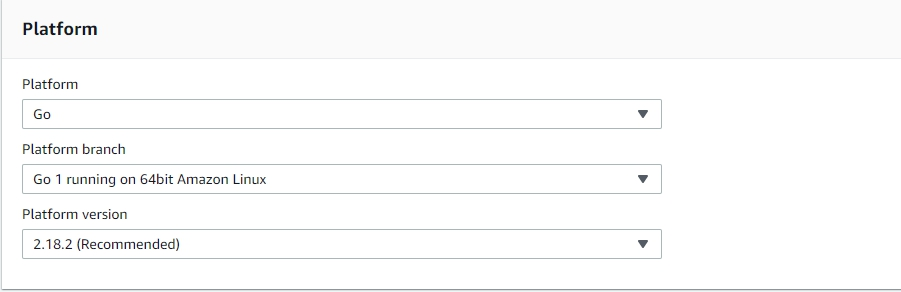
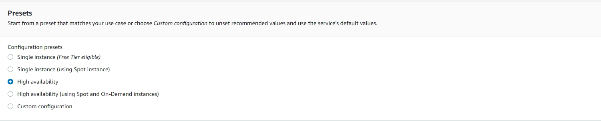
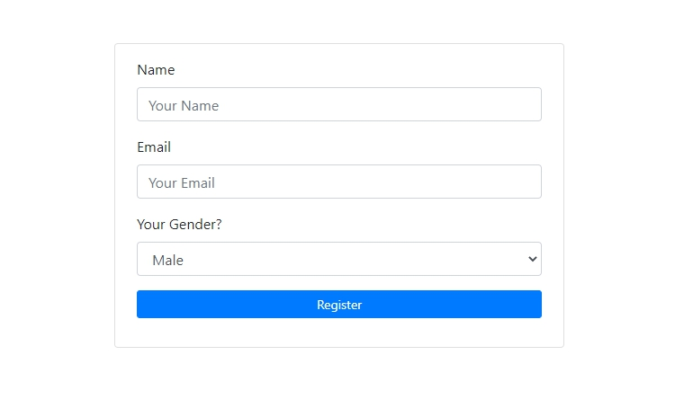

# Frontend

A sample application for AWS Elastic Beanstalk worker tier, implemented in go script.
This application recieves user informatino send it to a certain AWS SQS and Store the data in AWS Dynamodb 

## How to use

1. Create a Dynamodb and SQS

2. Download file as zip

3. In ./ebextensions/setup.config. Change the table name and queue url

4. Zip the files back

5. Go to AWS Elastic Beanstalk and create a new application. 
* Platform : Go
* Platform branch : Go 1 running on 64bit Amazon Linux
* Platform version : 2.18.2

  

6. Upload this file(as .zip)

7. Select Configure more options 
* Select High availability

* Edit Instances
* Edit Security

8. Create app

## How it runs
1. Fill in your information

2. You will find out data stored in dynamodb

3. You will find out data sent to SQS